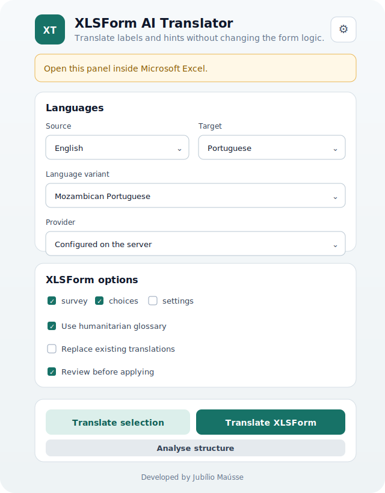
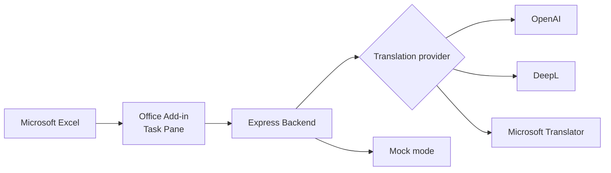

<p align="center">
  
</p>

<h1 align="center">XLSForm AI Translator</h1>

<p align="center">
  <strong>Traduza questionários KoboToolbox/XLSForm directamente no Microsoft Excel, preservando fórmulas, variáveis, placeholders, formatação e a lógica do formulário.</strong>
</p>

<p align="center">
  <em>Translate KoboToolbox/XLSForm questionnaires directly inside Microsoft Excel while preserving formulas, variables, placeholders, formatting and form logic.</em>
</p>

<p align="center">
  
  
  
  
  
  
</p>

> **Concebido para equipas humanitárias, organizações não-governamentais, instituições públicas, universidades, investigadores e profissionais de Monitoria e Avaliação.**

O suplemento traduz conteúdos linguísticos de um XLSForm sem alterar os elementos técnicos que fazem o formulário funcionar. Pode traduzir uma selecção de células ou criar automaticamente novas colunas de idioma nas folhas `survey` e `choices`.

## Interface

### Painel dentro do Microsoft Excel

<p align="center">
  
</p>

### Pré-visualização do painel de desenvolvimento

<p align="center">
  
</p>

## Principais funcionalidades

- Tradução da célula ou do intervalo actualmente seleccionado.
- Tradução automática das folhas `survey` e `choices`.
- Criação de colunas como `label::Portuguese`, sem apagar `label::English`.
- Preservação de `${variáveis}`, HTML, URLs, quebras de linha e placeholders.
- Protecção de fórmulas, nomes de variáveis e lógica condicional.
- Preservação da formatação das células.
- Pré-visualização editável antes de aplicar qualquer alteração.
- Glossário humanitário Inglês–Português incorporado.
- Registo oculto de alterações na folha `_translation_log`.
- Backend seguro compatível com OpenAI, DeepL e Microsoft Translator.
- Modo `mock` para testar o fluxo sem chave de API.
- Testes automáticos e XLSForm de exemplo.

## Casos de uso

- Questionários KoboToolbox e ODK.
- Avaliações rápidas de necessidades.
- Inquéritos domiciliares e comunitários.
- Avaliações de saúde, educação, WASH, segurança alimentar e protecção.
- Monitoria, Avaliação, Responsabilização e Aprendizagem.
- Investigação académica e recolha multilingue de dados.
- Formulários institucionais de ministérios, universidades e organizações humanitárias.

## Público-alvo

- Organizações humanitárias e de desenvolvimento.
- Agências das Nações Unidas e organizações não-governamentais.
- Instituições governamentais.
- Universidades e centros de investigação.
- Equipas de dados, GIS, IM, MEAL e avaliação.
- Consultores e programadores de formulários Kobo/XLSForm.

## Arquitectura



As chaves de API permanecem no backend e nunca são expostas ao código executado dentro do Excel.

## Requisitos

- Windows 10/11, macOS ou Excel para a Web.
- Microsoft Excel com suporte a Office Add-ins.
- Node.js 20 ou superior; Node.js 22 é recomendado.
- VS Code é recomendado, mas não obrigatório.

## Instalação rápida

### 1. Clonar e abrir o projecto

```powershell
git clone https://github.com/Jubilio/xlsform-ai-translator.git
cd xlsform-ai-translator
```

### 2. Instalar as dependências

```powershell
npm install
```

### 3. Criar o ficheiro de configuração

No PowerShell:

```powershell
Copy-Item .env.example .env
```

No Prompt de Comando:

```cmd
copy .env.example .env
```

O projecto inicia com:

```env
TRANSLATION_PROVIDER=mock
```

Este modo não utiliza uma chave de API e serve para validar o funcionamento do suplemento.

### 4. Criar e confiar no certificado HTTPS local

```powershell
npm run certs
```

No Windows, instale o certificado no repositório de confiança do utilizador:

```powershell
npm run trust:cert:windows
```

No macOS, abra `certs/localhost.crt` no Keychain Access e marque-o como confiável para SSL.

### 5. Iniciar o painel e o backend

```powershell
npm run dev
```

Mantenha este terminal aberto. O painel ficará disponível em `https://localhost:3000` e o backend em `http://localhost:3001`.

### 6. Abrir o suplemento no Excel

Num segundo terminal:

```powershell
npm run sideload
```

O Excel deverá abrir e mostrar o botão **Traduzir XLSForm** no separador **Base/Home**.

Para encerrar a sessão de sideload:

```powershell
npm run stop
```

## Instalação manual no Excel para a Web

1. Abra um ficheiro no Excel para a Web.
2. Seleccione **Base/Home > Add-ins > More Add-ins**.
3. Abra **My Add-ins**.
4. Escolha **Upload My Add-in**.
5. Seleccione `manifest.xml`.
6. Abra o painel **Traduzir XLSForm**.

O servidor local iniciado com `npm run dev` deve permanecer activo.

## Configurar um provedor de tradução

Edite `.env` e escolha um provedor padrão.

### OpenAI

```env
TRANSLATION_PROVIDER=openai
OPENAI_API_KEY=coloque_a_chave_aqui
OPENAI_MODEL=gpt-5-mini
```

A chave é utilizada apenas pelo backend. `OPENAI_MODEL` pode ser alterado para outro modelo compatível disponível na conta utilizada.

### DeepL

```env
TRANSLATION_PROVIDER=deepl
DEEPL_API_KEY=coloque_a_chave_aqui
DEEPL_API_URL=https://api-free.deepl.com/v2/translate
```

Para uma conta Pro, utilize `https://api.deepl.com/v2/translate`.

### Microsoft Translator

```env
TRANSLATION_PROVIDER=microsoft
AZURE_TRANSLATOR_KEY=coloque_a_chave_aqui
AZURE_TRANSLATOR_REGION=sua_regiao_azure
```

Depois de alterar `.env`, reinicie `npm run dev`.

## Como utilizar

### Traduzir células seleccionadas

1. Seleccione uma célula ou intervalo com texto.
2. Escolha os idiomas de origem e destino.
3. Clique em **Traduzir selecção**.
4. Reveja e edite as propostas.
5. Clique em **Aplicar traduções**.

A tradução substitui o texto das células seleccionadas, mas mantém a sua formatação. Fórmulas, números e células vazias são ignorados.

### Traduzir um XLSForm completo

1. Abra o ficheiro XLSForm.
2. Escolha, por exemplo, `English` → `Portuguese`.
3. Mantenha `survey` e `choices` seleccionadas.
4. Clique em **Analisar estrutura** para verificar quantas células serão processadas.
5. Clique em **Traduzir XLSForm**.
6. Reveja e edite as traduções propostas.
7. Clique em **Aplicar traduções**.

Exemplo de colunas:

```text
label::English  ->  label::Portuguese
hint::English   ->  hint::Portuguese
```

Quando a coluna de destino não existe, o suplemento cria-a no fim da folha. Quando já existe, por padrão apenas as células vazias são preenchidas.

## Colunas traduzidas automaticamente

- `label::<idioma>`
- `hint::<idioma>`
- `guidance_hint::<idioma>`
- `required_message::<idioma>`
- `constraint_message::<idioma>`

## Elementos que não são traduzidos automaticamente

- `type`
- `name`
- `list_name`
- `relevant`
- `constraint`
- `calculation`
- `choice_filter`
- `appearance`
- `repeat_count`
- `default`
- `parameters`
- `bind::*`
- `instance::*`
- fórmulas iniciadas por `=`

## Protecção de conteúdo interno

Antes de enviar texto ao provedor, o suplemento protege elementos como:

```text
${household_name}
<b>Important</b>
https://example.org
\n
```

Depois da tradução, estes elementos são repostos e validados. Qualquer diferença é apresentada como aviso na pré-visualização e registada em `_translation_log`.

> **Protecção de dados:** não envie respostas de participantes, dados pessoais ou informação sensível a serviços externos de tradução. O suplemento foi concebido para traduzir a estrutura do questionário, não os dados recolhidos.

## Testar com o exemplo

Abra:

```text
examples/sample-xlsform.xlsx
```

No modo `mock`, algumas frases comuns são traduzidas e as restantes recebem o prefixo `[DEMO PT]`, indicando claramente que não são traduções finais.

## Verificação técnica

```powershell
npm run validate:manifest
npm run typecheck
npm test
npm run build
```

A validação do manifesto descarrega a ferramenta da Microsoft apenas quando necessária.

## Roadmap

- [ ] Memória de tradução reutilizável entre projectos.
- [ ] Editor de glossários personalizados.
- [ ] Detecção automática do idioma de origem.
- [ ] Pontuação de qualidade e consistência terminológica.
- [ ] Pacotes de glossário para sectores humanitários adicionais.
- [ ] Processamento por lotes com controlo de custos.
- [ ] Vídeo ou GIF curto de demonstração.
- [ ] Publicação no Microsoft AppSource.

Consulte os pedidos e propostas de funcionalidades na secção **Issues** do repositório.

## Perguntas frequentes

### O suplemento altera nomes de variáveis?

Não. Colunas técnicas como `name`, `type`, `relevant`, `constraint` e `calculation` são protegidas.

### As fórmulas são traduzidas?

Não. Células iniciadas por `=` são ignoradas.

### O HTML é preservado?

Sim. As etiquetas HTML são protegidas e repostas depois da tradução.

### Funciona com KoboToolbox?

Sim. O suplemento foi concebido para ficheiros XLSForm compatíveis com KoboToolbox e ODK.

### Pode substituir traduções existentes?

Sim, mas apenas quando a opção **Substituir traduções existentes** estiver activada. Por padrão, o suplemento preenche apenas células vazias.

### Funciona sem Internet?

O fluxo pode ser testado localmente no modo `mock`. Uma tradução real através de OpenAI, DeepL ou Microsoft Translator requer ligação à Internet e credenciais válidas.

### As chaves de API ficam no Excel?

Não. As chaves são utilizadas exclusivamente pelo backend.

## Limitações da versão 1.0

- O glossário incorporado é mais completo para Inglês → Português.
- DeepL e Microsoft Translator podem não suportar todos os idiomas apresentados.
- O suplemento não deve ser utilizado para enviar respostas pessoais ou dados sensíveis a serviços externos.
- Em folhas muito grandes, recomenda-se traduzir por blocos e rever previamente os custos da API.
- A qualidade final deve ser revista por uma pessoa fluente no idioma de destino.

## Publicação institucional

Para utilização interna numa organização:

1. Aloje `dist/` e o backend num domínio HTTPS institucional.
2. Substitua todas as ocorrências de `https://localhost:3000` no `manifest.xml` pelo domínio real.
3. Guarde as chaves num gestor de segredos ou em variáveis de ambiente do servidor.
4. Valide o manifesto.
5. Faça a implantação centralizada através do Microsoft 365 Admin Center.
6. Conclua uma revisão de protecção de dados antes de disponibilizar o Add-in.

Consulte também [`SECURITY.md`](SECURITY.md), [`docs/ARCHITECTURE.md`](docs/ARCHITECTURE.md) e [`docs/TROUBLESHOOTING.md`](docs/TROUBLESHOOTING.md).

## Contribuir

Contribuições são bem-vindas.

1. Faça um fork do repositório.
2. Crie uma branch para a alteração: `git checkout -b feature/minha-alteracao`.
3. Faça os commits necessários.
4. Execute `npm run typecheck`, `npm test` e `npm run build`.
5. Abra um Pull Request com uma descrição clara da alteração.

Para falhas de segurança, siga as instruções de [`SECURITY.md`](SECURITY.md) em vez de abrir uma Issue pública.

## Licença

Distribuído sob a licença MIT. Consulte [`LICENSE`](LICENSE).

## Autor

**Jubílio Maússe**

- GitHub: [@Jubilio](https://github.com/Jubilio)
- LinkedIn: [jubiliomausse](https://www.linkedin.com/in/jubiliomausse)

---

<p align="center">
  Desenvolvido para tornar a tradução de XLSForms mais rápida, segura e consistente.
</p>
